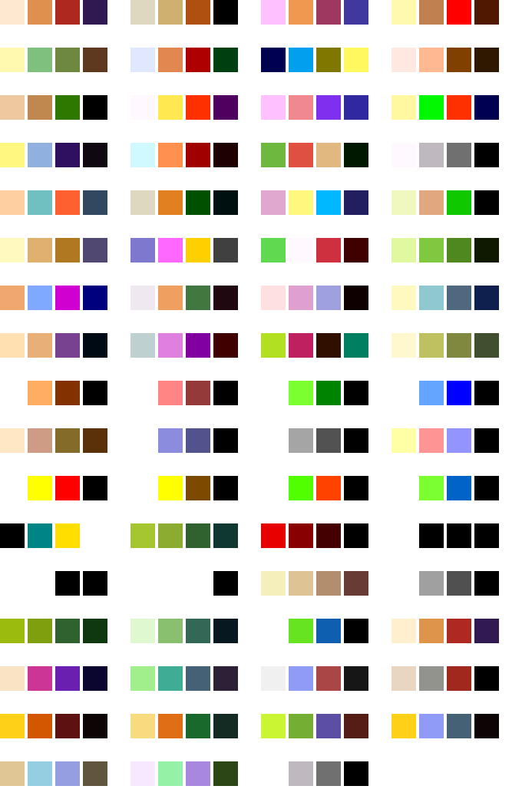

# GBCamJS

A collection of JavaScript tools and assets for the Game Boy Camera™.

## Installation

```bash
npm install gbcam-js
```

## Save parsing

The primary function of this library is to parse raw Game Boy Camera save files (`.sav`).

Here's a basic example of how to read a save file and parse its contents in a Node.js environment:

```javascript
import { promises as fs } from 'fs';
import parseSave from 'gbcam-js'; // Or your path to main.js/parsesave.js

async function main() {
    try {
        // Read the raw save file data. In Node.js, this returns a Buffer,
        // which is a subclass of Uint8Array.
        const saveData = await fs.readFile('./your-save-file.sav');

        // Parse the data
        const parsedData = parseSave(saveData);

        console.log(`Username: ${parsedData.username}`);
        console.log(`Gender: ${parsedData.gender}`);
        console.log(`Found ${parsedData.images.length} images.`);

        // Accessing image data (this is lazy-loaded)
        const firstImage = parsedData.images[0];
        if (!firstImage.isDeleted) {
            console.log(`First image comment: ${firstImage.comment}`);
            console.log(`First image frame ID: ${firstImage.frameId}`);
            // The `photoData` getter will decode the image on first access.
            const pixelData = firstImage.photoData;
            console.log(`First image has ${pixelData.length} pixels.`);
        }
    } catch (error) {
        console.error('Error processing save file:', error);
    }
}

main();
```

## API Reference

### `parseSave(saveData)`

The main export. Parses the entire Game Boy Camera save file.

-   **`saveData`**: `Uint8Array | ArrayBuffer` - The raw binary data from the `.sav` file. Can be a Node.js `Buffer`, a standard `Uint8Array`, or an `ArrayBuffer`.
-   **Returns**: `object` - An object containing the parsed save data.

The returned object has the following structure:

```js
{
  username: string,
  gender: 'male' | 'female',
  images: [
    {
      width: number,      // Image width (128)
      height: number,     // Image height (112)
      comment: string,    // Photo comment
      frameId: string,    // The ID of the frame used (1-based)
      isDeleted: boolean, // True if the photo slot is marked as deleted
      photoData: number[] // A lazy-loaded array of palette indices (0-3) for each pixel
    },
    ... // (30 images in total)
  ]
}
```

_Save parsing logic was based on gbcam2png and information from Raphael-Boichot's research._

_Game Boy™, Game Boy Camera™, Game Boy Color™, and Super Game Boy™ are registered trademarks of Nintendo._

### Palettes

Palettes can be apply to the image data using a canvas


